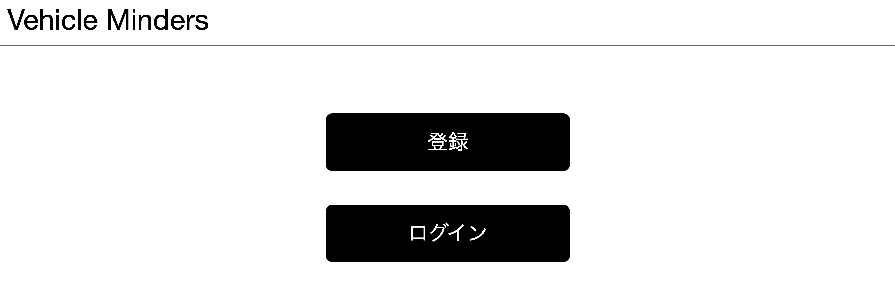
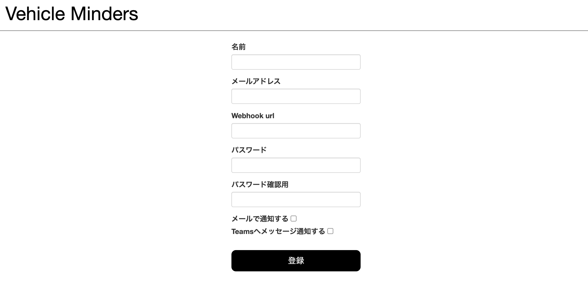
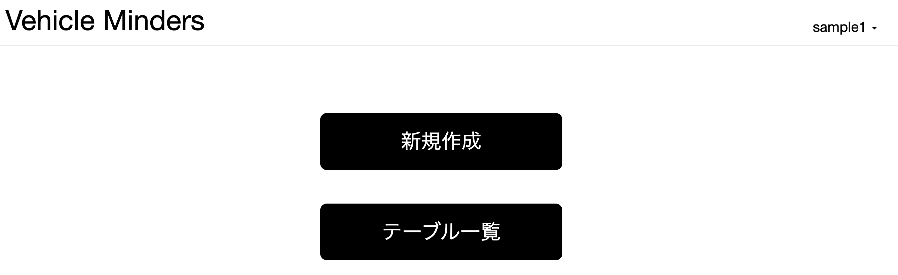
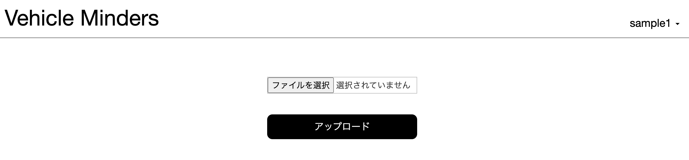
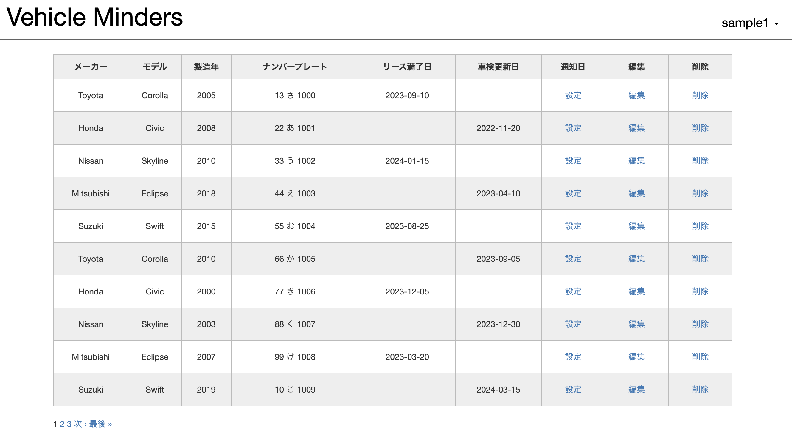
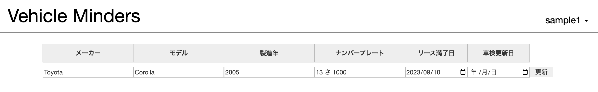
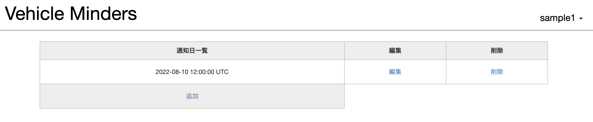
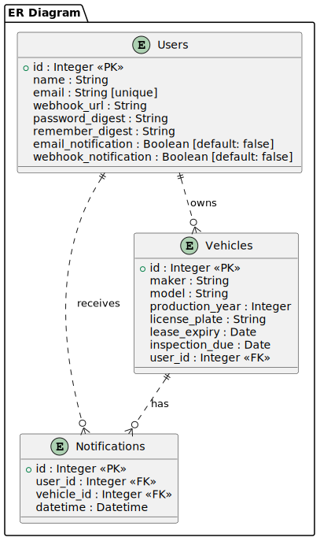

### 概要
- 業務用車の車検・リース更新日通知サービス『Vehicle Minders』
業務用車の車検やリースの更新日を通知するサービスです。ユーザーがそれぞれの業務用車の詳細（モデル、ナンバープレート、更新日など）を登録できるようになっています。そして、指定した日時に指定した連絡先（メールアドレス、MicroSoft Teams）にリマインダーを自動的に送信します。これにより、業務用車の車検やリース更新を追跡するためのエクセル管理の手間を省き、人為的なミスを防止することが可能になります。

### サービスURL
- https://vehicleminders.com/

### サービス画面キャプチャ
- ホーム画面(ログイン前)

- ユーザー登録画面

- ホーム画面(ログイン後)

- CSVアップロード画面

- データ一覧画面

- データ編集画面

- 通知時間編集画面

### 使用技術
- バックエンド
 - Ruby 3.1.4
 - Ruby on Rails 7.0.6
 - Rubocop
 - Rspec
 - Nginx
 - Sidekiq

- フロントエンド
 - HTML, CSS
 - JavaScript

- インフラ
 - Docker, Docker-compose
 - AWS ( EC2, RDS, ALB, Route53, ElastiCache for Redis, SES)
 - Teams Incommig Webhook

### ER図

### インフラ構成図

### 機能一覧
- ユーザー登録・編集機能、ログイン機能
 - リマインド方法としてメールアドレスとMicrosoft Teams Incoming WebhookのURLを登録できる
 - 各通知方法はオンとオフを切り替えられる
- 車両情報の登録・編集機能
    - 備品の基本的な情報（例えば、メーカー、モデル、製造年、車検満了日、リース満了日など）を登録できる。登録したデータは編集や削除ができる
    - 各車両データには通知日を紐づけて登録できる
- CSVファイルアップロード機能
    - ローカルのCSVファイルをアップロードできる
- リマインダー機能
    - 各車両データに紐づいた通知日に設定した通知方法でリマインドされる
