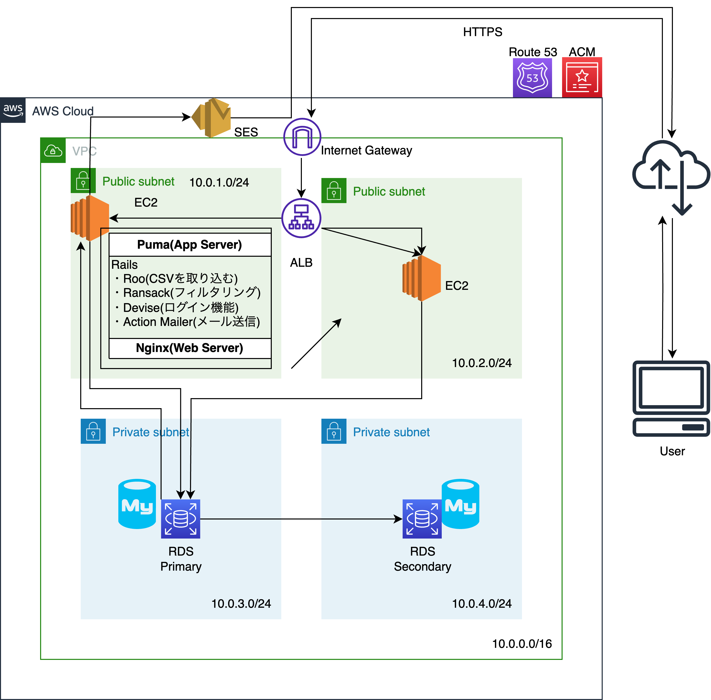

## オリジナルプロダクト案
### 一言サービスコンセプト（サービスのキャッチコピーを一言で）
- 業務用備品のスマート管理サービス
### 誰のどんな課題を解決するのか
- 業務用の備品(業務用車)を管理している従業員がエクセルで車検満了日、リース満了日を入力し、車検の1ヶ月前などに関連事業地に連絡をするようにしてる。そのために毎月新しいシートを作って、該当車両があるかソートをかけてピックアップしている。作業自体は1時間もかからないが、エクセルのシートの管理が面倒なのと人的ミスが発生してしまう(誤入力や、業務を忘れるなど)という課題がある。
### なぜそれを解消したいのか
- 知り合いがキャンプ場で働いており、キャンプ場で使う業務用車の管理が大変と聞いた、自分自身も学生の頃にそのキャンプ場で働いていたため、何か力になることをしたいと考えたから。
### どうやって解決するのか
- 備品の各属性の登録、更新、削除、検索ができ、指定した日時にリマインドできるアプリを開発して使ってもらう。
### 機能要件
- 車両情報の登録・管理機能
    - 備品の基本的な情報（例えば、メーカー、モデル、製造年、車検満了日、リース満了日など）を登録できるようにする。その情報は、更新や削除も可能で、データベースに保存される。
- ファイル読み込み機能
    - ローカルのCSVファイルを読み込める。
- 検索・フィルター機能
    - ユーザーが登録した車両情報を検索やフィルタリングができる。
- リマインダー・アラート機能
    - 車検満了日やリース満了日などの重要な日付が近づくと、自動的に指定した連絡先にリマインダーが送信される。
- ダッシュボード機能
    - 全ての車両の概要や状況を一目で把握できるダッシュボードが使える。
- ログイン機能
### 非機能要件
- 保守性
    - 静的解析ツールやコードの自動フォーマットツールを使って可読性を高める。
- 運用性
    - GitHub ActionsでCI/CDを設定する。
- セキュリティ機能
    - 通信の暗号化、パスワードのハッシュ化、データ(特にメールアドレス)の暗号化。
- 費用
    - 5000〜10000/月

<h3>業務フロー</h3>

<h3>画面遷移図</h3>

<h3>ワイヤーフレーム</h3>

<h3>テーブル定義</h3>

車両テーブル（Vehicles）

| カラム名      | データ型       | NULL | キー | 初期値 | AUTO INCREMENT | 説明 |
| ------------- | -----------|--|--|--|--|----------------------------- |
| vehicle_id    | Integer    ||主キー||YES||
| make          | String     ||||| 車両のメーカー名             |
| model         | String     ||||| 車両のモデル名              |
| year          | Integer    ||||| 車両の製造年                |
| license_plate | String     ||||| ナンバープレート番号        |
| lease_expiry  | Date       |YES|||| リースの満了日              |
| inspection_due| Date       |YES|||| 次の車検日 |

ユーザーテーブル（Users）

| カラム名      | データ型       | NULL | キー | 初期値 | AUTO INCREMENT | 説明 |
| ------------- | -----------|--|--|--|--|----------------------------- |
| user_id      | Integer        ||主キー||YES||
| name         | String         ||||| ユーザー名                  |
| email        | String         ||||| メールアドレス              |
| password     | String         ||||| パスワード（ハッシュ化済み） |

通知テーブル（Notifications）

| カラム名      | データ型       | NULL | キー | 初期値 | AUTO INCREMENT | 説明 |
| ------------- | -----------|--|--|--|--|----------------------------- |
| notification_id | Integer        ||主キー||YES||
| user_id         | Integer   ||外部キー|||通知を受け取るユーザーID   |
| vehicle_id      | Integer    ||外部キー|||通知に関連する車両ID       |
| date            | Date       |||||通知を送る日                |

 <h3>システム構成図</h3> 

